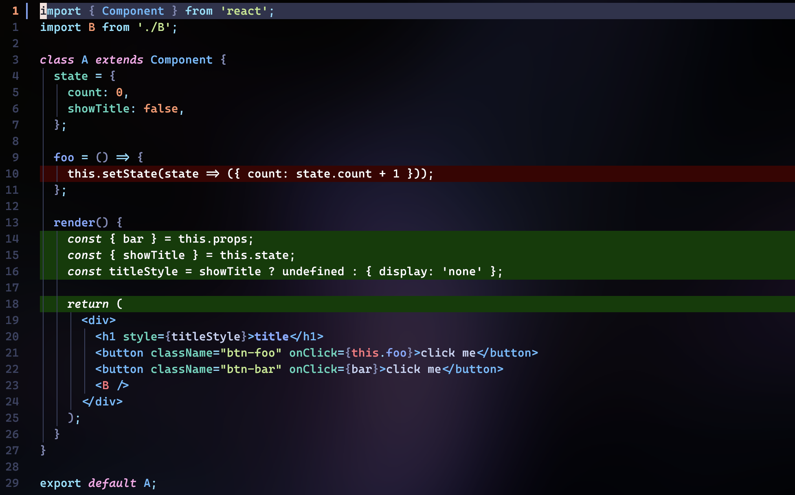
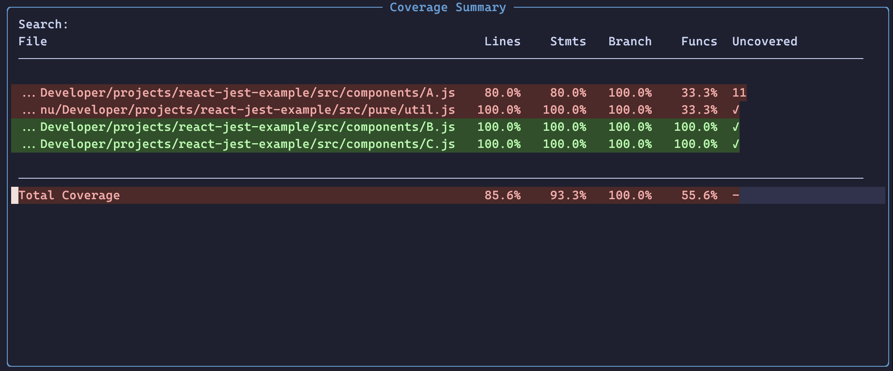

# Coverage plugin for lcov files

This plugin provides a way to visualize code coverage data in lcov format.
It can be used with various testing frameworks and CI/CD pipelines.

By default, it will highlight lines in your code when you open a file based on coverage data if present.

## Installation

- Using Lazy:

```lua
  return {
    {
      "devzambra/coverage.nvim",
      config = function()
        require("coverage").setup()
      end,
    }
  }
```

## Features

- Supports lcov format
- Displays coverage data in a user-friendly format
- Highlights uncovered, covered and partially covered lines



- Summary window with overall coverage statistics



## Default keymaps

- `<leader>tcr` -> Reload coverage data
- `<leader>tcs` -> Show summary window
- `<leader>tct` -> Toggle highlights on/off

## Available commands

- `CoverageRefresh` -> Refreshes coverage data
